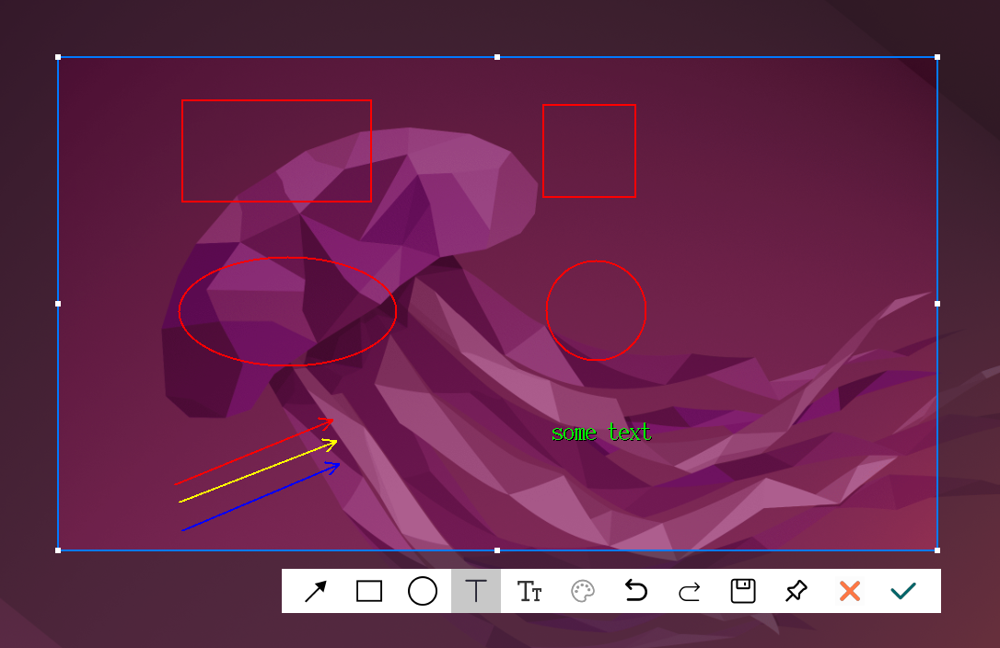
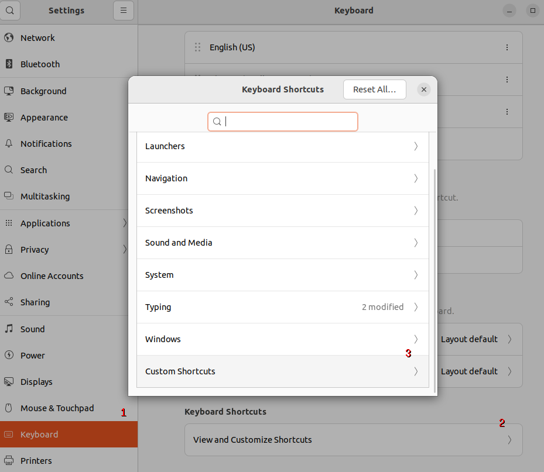
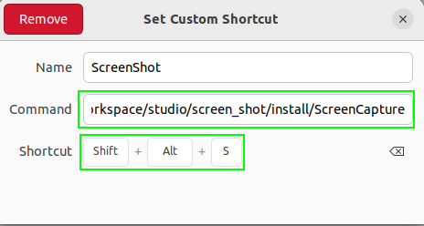

# Screen Capture

一个轻量级的 X11 截屏工具，纯 C++17 实现，无外部图像库依赖（除系统 X11 / zlib）。

## 功能特性

- 区域截屏：鼠标拖拽选择任意矩形区域
- 半透明灰色遮罩：选区外为半透明效果，选区内保持原图
- 绘图工具：箭头、矩形、椭圆、文字（支持中文 IME 输入）
- 颜色选择：红/黄/蓝/绿/灰/白/黑 共 7 种
- 操作：确认（保存到剪贴板 + 文件）、保存（仅文件）、取消、贴图（Pin）
- 撤销 / 重做：Ctrl+Z / Ctrl+Y
- 方向键微调：拉框后按 ←/→/↑/↓ 移动选区（Shift 加速 10px）
- 贴图窗口：可拖动、可关闭的浮动图片窗口
- 截图自动保存到 `~/Pictures/Screenshots/YYYYMMDD_hhmmss.png`

## 用法示例



## 构建

```bash
cd /path/to/screen_shot
mkdir -p build && cd build
cmake ..
make -j4 && make install
```

## 命令行运行

```bash
./install/ScreenCaptures
```

## 配置全局热键

Ubuntu 上 Setting -> Keyboard -> Shortcuts -> Custom -> + -> `Shift+Alt+S`





## 截图文件命名

保存路径：`~/Pictures/Screenshots/YYYYMMDD_hhmmss.png`

例：`~/Pictures/Screenshots/20260724_203045.png`

---

# English Version

A lightweight X11 screenshot tool, pure C++17 with no external image library dependencies (besides system X11 / zlib).

## Illustration


## Features

- Region capture: drag to select any rectangular area
- Semi-transparent gray mask outside the selection; original content preserved inside
- Drawing tools: Arrow, Rectangle, Ellipse, Text (with CJK / IME support)
- Color picker: 7 colors (Red / Yellow / Blue / Green / Gray / White / Black)
- Actions: Confirm (clipboard + file), Save (file only), Cancel, Pin (float on screen)
- Undo / Redo: Ctrl+Z / Ctrl+Y
- Arrow-key nudge: after drawing the selection, press ← / → / ↑ / ↓ to move it (Shift = 10px step)
- Pin window: draggable / closable floating image window
- Auto-saved to `~/Pictures/Screenshots/YYYYMMDD_hhmmss.png`


## Build

```bash
cd /path/to/screen_shot
mkdir -p build && cd build
cmake ..
make -j4 && make install
```

Output: `install/ScreenCaptures`

## Run in Command Line

```bash
./install/ScreenCaptures
```

## Screenshot File Naming

Saved to: `~/Pictures/Screenshots/YYYYMMDD_hhmmss.png`

Example: `~/Pictures/Screenshots/20260724_203045.png`

## Custom Keyboard Shortcut

Ubuntu right top corner  
Setting -> Keyboard -> Shortcuts -> Custom -> + -> `Shift+Alt+S`


